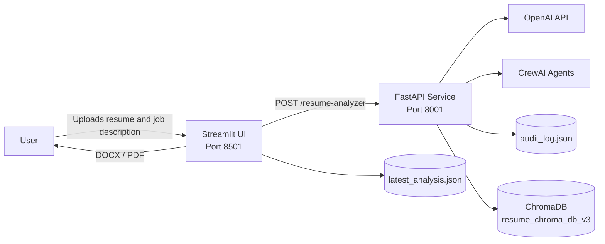
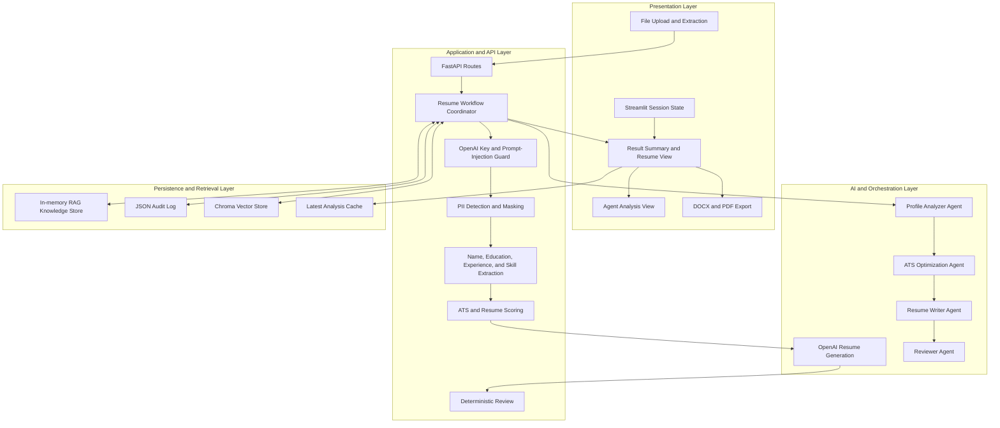
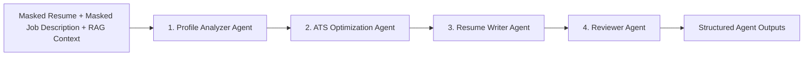
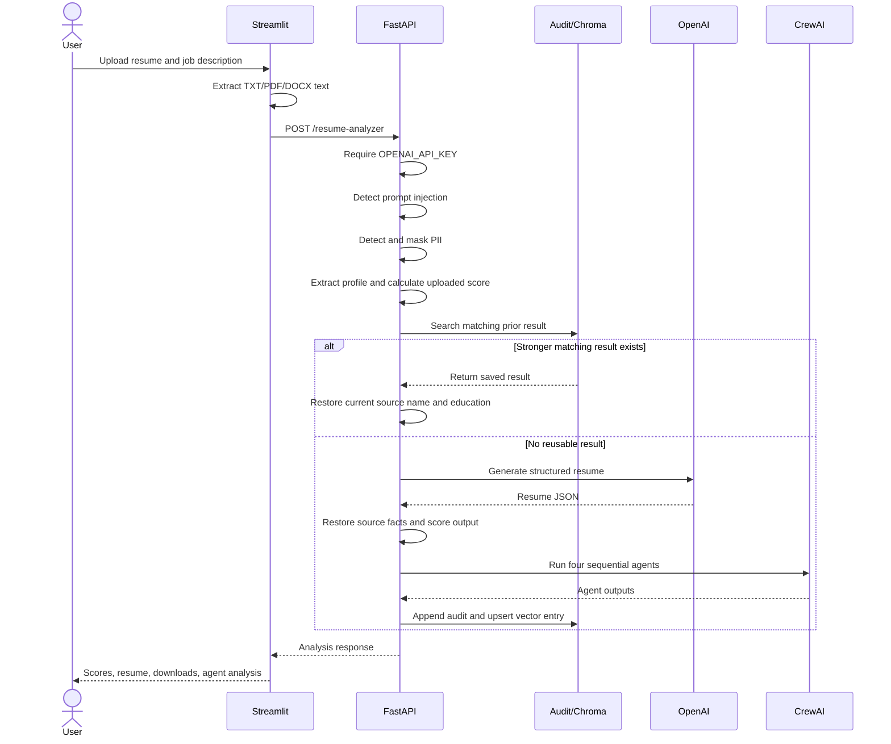

# Enterprise AI Resume Generator

## Architecture and Design Document

**Version:** 1.0  
**Application type:** Local web application with REST API  
**Primary technologies:** Python, Streamlit, FastAPI, OpenAI, CrewAI, ChromaDB

## 1. Purpose

The Enterprise AI Resume Generator analyzes an uploaded resume against a job description, calculates ATS-oriented alignment scores, generates an improved resume, and exposes the intermediate CrewAI agent outputs for review.

The system is designed to:

- Accept `.txt`, `.pdf`, and `.docx` resumes and job descriptions.
- Extract candidate facts, skills, experience, and education.
- Detect prompt-injection phrases and mask supported PII before model processing.
- Calculate deterministic uploaded and improved resume scores.
- Generate ATS-friendly resume content with OpenAI.
- Run specialized CrewAI agents for profile, ATS, writing, and review analysis.
- Reuse a previous result only when both the resume and job description match.
- Export the improved resume as DOCX or PDF.
- Preserve the latest UI result during navigation to Agent Analysis.

## 2. System Context



The application runs as two local processes:

1. **Streamlit frontend** presents upload, analysis, result, download, and agent-detail views.
2. **FastAPI backend** owns validation, privacy controls, scoring, generation, orchestration, retrieval, and persistence.

## 3. Logical Architecture



## 4. Component Design

### 4.1 Streamlit Frontend

**File:** `streamlit_app.py`

Responsibilities:

- Accept resume and job-description uploads.
- Extract text from TXT, PDF, and DOCX files.
- Read WordprocessingML directly for DOCX content in paragraphs, tables, headers, footers, and text boxes.
- Send validated text to the FastAPI backend.
- Store the latest response in `st.session_state`.
- Clear stale results when selected input files change.
- Navigate between Resume Analyzer and Agent Analysis without losing the current result.
- Render scores, generated sections, workflow status, and agent outputs.
- Generate downloadable DOCX and PDF documents.

The input fingerprint consists of each selected file's name and size. It prevents a previous analysis from being displayed as though it belongs to newly selected files.

### 4.2 FastAPI Backend

**File:** `ResumeAnalyzer.py`

Responsibilities:

- Validate requests with Pydantic.
- Reject processing when `OPENAI_API_KEY` is absent.
- Detect common prompt-injection phrases.
- Detect and mask supported PII.
- Extract candidate name, education, skills, and experience.
- Classify the candidate domain and level.
- Calculate deterministic resume and ATS scores.
- Retrieve matching historical context.
- Generate improved content through OpenAI.
- Run the CrewAI workflow.
- Restore source-controlled identity and education fields.
- Persist completed analysis records.

### 4.3 OpenAI Resume Generation

`generate_resume_content` submits a structured prompt containing:

- Deterministic candidate profile.
- Masked resume context.
- Masked job description.
- Uploaded resume score.
- Required JSON output schema.

The expected output contains:

- `professional_summary`
- `experience_bullets`
- `skills_section`
- `project_descriptions`
- `education_section`

If the generated score does not improve on the uploaded score, the application makes one retry request. Candidate name and education are overwritten afterward with facts extracted from the uploaded resume, preventing model placeholders from becoming final data.

Although deterministic fallback-building code remains as an internal parsing default, the main workflow stops before generation when `OPENAI_API_KEY` is not configured. A fallback resume is therefore not returned to the user in that condition.

### 4.4 CrewAI Agent Design



The crew uses `Process.sequential` to preserve the intended order.

| Agent | Responsibility | Expected output |
|---|---|---|
| Profile Analyzer Agent | Identifies level, domain, experience, skills, education, projects, and certifications | Candidate profile JSON |
| ATS Optimization Agent | Finds missing keywords and assesses ATS readiness | Missing keywords, score, recommendations |
| Resume Writer Agent | Produces ATS-friendly resume sections | Summary, skills, experience, projects, education |
| Reviewer Agent | Reviews grammar, structure, and readiness | Validation status and notes |

CrewAI outputs are retained for the Agent Analysis page. The final displayed resume is produced by the primary generation path and then constrained by deterministic source-data rules.

### 4.5 Retrieval-Augmented Context

The system uses two retrieval mechanisms:

1. **In-memory lexical retrieval** ranks current and historical text using token overlap.
2. **ChromaDB retrieval** stores a compact payload with a deterministic local hashing vector.

The local vector representation does not require an external embedding API. Chroma is optional; if unavailable, the application falls back to lexical audit-log search.

A saved result is reusable only when:

- Job-description similarity is at least `0.45`.
- Resume similarity is at least `0.80`.
- The saved generated score is greater than the current uploaded score.

Requiring both documents to match prevents one candidate from receiving another candidate's saved resume.

## 5. Request Processing Sequence



## 6. Data Design

### 6.1 Resume Request

```json
{
  "candidate_name": "Candidate Name",
  "resume_text": "Extracted resume text",
  "job_description": "Extracted job description",
  "user_id": "streamlit-user"
}
```

`resume_text` and `job_description` must each contain at least 10 characters.

### 6.2 Analysis Response

Important fields include:

| Field | Purpose |
|---|---|
| `request_id` | Correlates response, audit entry, and vector record |
| `status` | Completed, Blocked, or Configuration Required |
| `candidate_name` | Validated name extracted from source, otherwise blank |
| `pii_detected` | PII category flags |
| `profile_analysis` | Deterministic candidate profile |
| `uploaded_resume_score_out_of_10` | Original alignment score |
| `improved_resume_score_out_of_10` | Generated resume score |
| `ats_optimization` | Missing keywords and ATS recommendations |
| `decision` | Generate or reuse decision |
| `generated_resume` | Structured final resume |
| `review` | Deterministic completeness review |
| `crewai` | Crew status and individual agent outputs |
| `used_existing_log` | Indicates historical-result reuse |

### 6.3 Persistence

| Store | Purpose | Format |
|---|---|---|
| `audit_log.json` | Human-readable workflow history and reuse source | JSON array |
| `resume_chroma_db_v3/` | Similarity search over saved analyses | ChromaDB |
| `latest_analysis.json` | Latest result available to the UI | JSON object |
| `st.session_state` | Current browser-session result and input fingerprint | In-memory |

## 7. Scoring Design

### 7.1 Uploaded Resume Score

Let:

- $J$ be the set of recognized skills in the job description.
- $R$ be the set of recognized skills in the resume.

The base score is:

$$
S_{base} = 10 \times \frac{|J \cap R|}{\max(|J|, 1)}
$$

Structural bonuses are added when both documents contain the corresponding concept:

- Experience: `+1.0`
- Projects: `+0.5`
- Education: `+0.5`

The final score is rounded to one decimal place and capped at `10.0`.

### 7.2 Generated Resume Score

Structured generated sections are flattened and evaluated with the same base formula. The scorer also:

- Recognizes populated structured experience, project, and education fields.
- Adds `0.5` when all required resume sections are populated.
- Caps the result at `10.0`.

### 7.3 Truthfulness Guard

ATS keywords are added to the improved skills section only when they are already supported by the uploaded resume. This reduces unsupported keyword insertion.

Candidate name and education are always restored from source extraction after generation. If education cannot be extracted, the system reports that it was not provided instead of accepting model-generated qualifications.

## 8. Security and Privacy Design

### 8.1 OpenAI Key Requirement

If `OPENAI_API_KEY` is missing, the backend returns:

- Status: `Configuration Required`
- Reason: `missing_openai_api_key`
- No generated resume

The UI displays an actionable error rather than generating fallback content.

### 8.2 Prompt-Injection Detection

The backend blocks requests containing known instruction-override phrases such as attempts to ignore instructions, override system behavior, bypass security, or inject code.

This is a basic keyword control, not a complete prompt-injection defense.

### 8.3 PII Detection and Masking

The application detects supported categories:

- Email addresses
- Phone numbers
- Potential eight-digit account numbers

Before analysis and LLM processing, it masks:

- Email addresses
- LinkedIn profile URLs
- Plausible domestic and international phone numbers
- Eight-digit account identifiers

Only PII category flags are returned in the response.

### 8.4 Current Privacy Limitation

The model-facing resume and job description are masked. However, `audit_log.json` currently stores the original unmasked `resume_text` and `job_description` for matching and audit purposes. This file must be treated as sensitive and should not be submitted with real candidate data.

For production use, the design should be changed to encrypted storage, redacted audit records, retention limits, authenticated access, and per-user data isolation.

## 9. API Design

| Method | Route | Purpose |
|---|---|---|
| GET | `/` | API discovery message |
| GET | `/health` | Service health check |
| POST | `/support` | Adapts free-form text to the resume workflow |
| POST | `/resume-analyzer` | Main analysis endpoint used by Streamlit |
| POST | `/resume-generator` | Alias for the shared generation workflow |

Default local URLs:

- Streamlit: `http://127.0.0.1:8501`
- FastAPI: `http://127.0.0.1:8001`
- FastAPI documentation: `http://127.0.0.1:8001/docs`

## 10. Error Handling

The design handles the following conditions:

| Condition | Behavior |
|---|---|
| Missing OpenAI key | Stop and return Configuration Required |
| Prompt injection detected | Stop and return Blocked |
| Unsupported upload type | Show a Streamlit validation error |
| Missing resume or job description | Show a warning before API submission |
| FastAPI unavailable | Show connection error in Streamlit |
| Optional Chroma unavailable | Continue with lexical retrieval |
| CrewAI unavailable or fails | Return crew status without crashing API |
| Invalid historical JSON | Treat history as empty |
| Invalid model JSON | Use controlled parsing defaults |

## 11. Deployment and Runtime

### 11.1 Environment Variables

| Variable | Required | Default |
|---|---|---|
| `OPENAI_API_KEY` | Yes | None |
| `OPENAI_MODEL` | No | `gpt-4o-mini` |
| `OPENAI_EMBEDDING_MODEL` | No | `text-embedding-3-small` |
| `FASTAPI_URL` | No | `http://127.0.0.1:8001/resume-analyzer` |

The embedding model variable is currently declared but local hashing vectors are used for Chroma retrieval.

### 11.2 Local Startup

Start FastAPI from the project directory:

```powershell
python -m uvicorn ResumeAnalyzer:app --host 127.0.0.1 --port 8001
```

Start Streamlit in a second terminal:

```powershell
python -m streamlit run streamlit_app.py --server.port 8501
```

### 11.3 Submission Packaging

Include:

- `ResumeAnalyzer.py`
- `streamlit_app.py`
- `test_resume_analyzer.py`
- `requirements.txt`
- `ARCHITECTURE_AND_DESIGN.md`

Exclude:

- `.env`
- `.venv/`
- `__pycache__/`
- `.pytest_cache/`
- Real candidate data in `audit_log.json`
- `latest_analysis.json`
- Local Chroma database directories, unless specifically requested
- Temporary HTML files

## 12. Testing Strategy

**File:** `test_resume_analyzer.py`

The automated tests cover:

- Required OpenAI key behavior.
- No fallback resume when the key is missing.
- Uploaded and improved score consistency.
- Source-controlled candidate name and education.
- Placeholder-name rejection.
- Multiline and inline education extraction.
- PII masking.
- Healthcare and finance domain classification.
- ATS score improvement safeguards.
- Saved-result matching and cross-resume isolation.
- Real-world retail resume layouts.

Current status: **21 passing tests**.

Run the suite with:

```powershell
python -m pytest test_resume_analyzer.py -q
```

## 13. Design Decisions and Tradeoffs

### Deterministic Controls Around LLM Output

The system does not trust generated identity or education fields. Deterministic extraction restores these values from the upload. This favors factual consistency over fully generative output.

### Local Persistence

JSON and ChromaDB keep the project easy to demonstrate without external infrastructure. The tradeoff is limited concurrency, security, retention management, and multi-user isolation.

### Separate Generation and CrewAI Paths

The primary OpenAI call creates the final structured resume. CrewAI provides specialized analysis outputs for transparency and demonstration. This makes the agent workflow visible but introduces extra model calls and potential disagreement between the generated resume and agent outputs.

### Heuristic ATS Scoring

The score is transparent and repeatable, making it suitable for demonstrations and testing. It is not an official score from a commercial ATS and should be presented as an internal alignment indicator.

## 14. Future Improvements

1. Replace JSON audit storage with an encrypted relational database.
2. Store only masked or hashed source text and define retention rules.
3. Add authentication, authorization, and per-user data isolation.
4. Validate OpenAI connectivity at startup and expose dependency health.
5. Use one coordinated agent pipeline as the authoritative generation path.
6. Add JSON schema validation and bounded retries for all model outputs.
7. Add OCR for image-only PDF resumes.
8. Add stronger prompt-injection classification and output moderation.
9. Move scoring weights into configuration and validate them against labeled datasets.
10. Add API integration tests and Streamlit browser tests.
11. Add structured logging, metrics, tracing, and request latency monitoring.
12. Containerize both services and add production secret management.

## 15. Summary

The project uses a layered local architecture with a Streamlit presentation layer, FastAPI workflow layer, deterministic extraction and scoring controls, OpenAI generation, CrewAI multi-agent analysis, and local JSON/Chroma persistence. Its strongest design feature is the use of deterministic privacy, scoring, matching, and source-fact controls around probabilistic model output. For production use, persistence security, user isolation, model-output validation, and observability would require further development.
