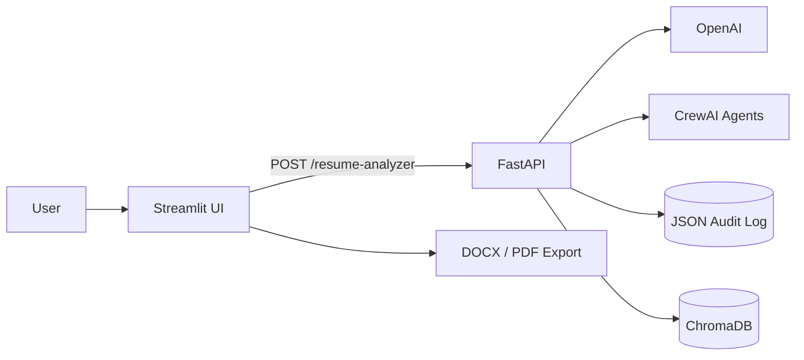
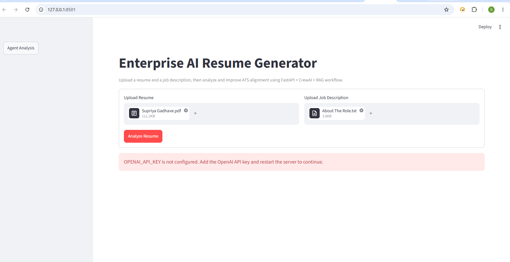
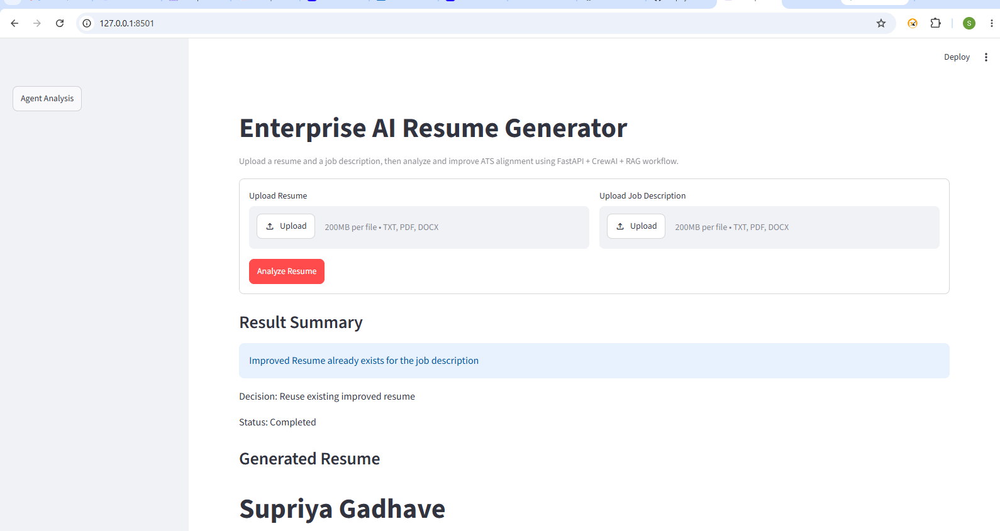
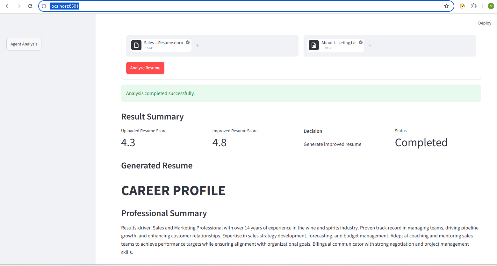
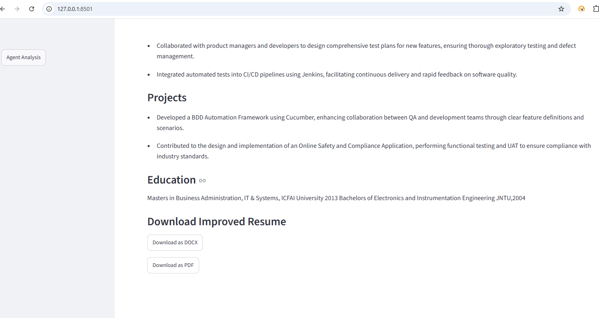
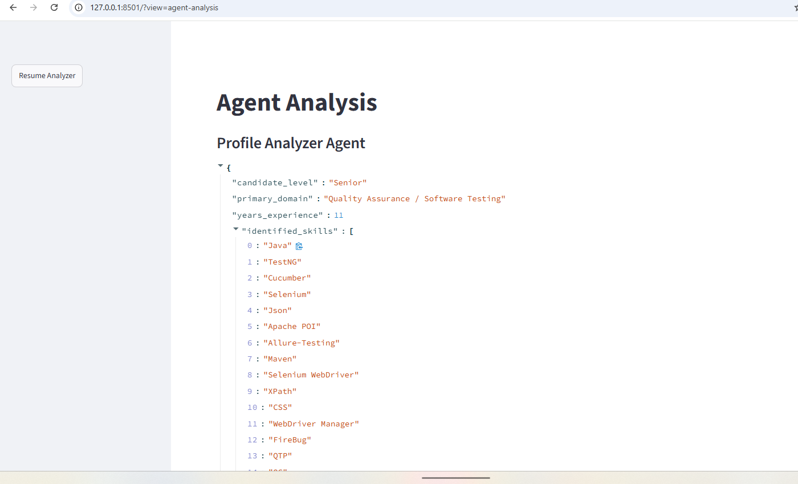
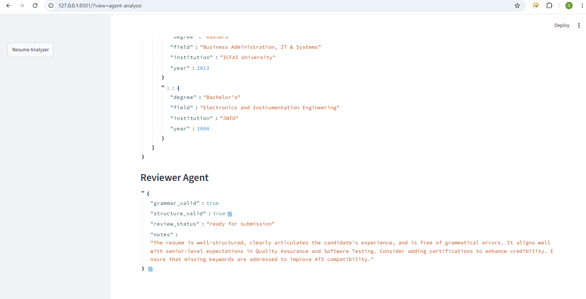

# Enterprise AI Resume Generator

A local AI-assisted resume analyzer that compares a resume with a job description, calculates transparent ATS-oriented scores, generates an improved resume, and exposes a four-agent CrewAI analysis workflow.

## Features

- TXT, PDF, and DOCX resume/job-description uploads
- DOCX extraction from paragraphs, tables, headers, footers, and text boxes
- Candidate name, education, experience, domain, and skill extraction
- Prompt-injection detection and PII masking before model processing
- Deterministic uploaded and improved resume scoring
- OpenAI-powered resume generation with a required API key
- Four sequential CrewAI agents: Profile Analyzer, ATS Optimizer, Resume Writer, and Reviewer
- RAG context from current inputs and previous analyses
- ChromaDB retrieval with lexical fallback
- Safe saved-result reuse requiring both resume and job-description similarity
- Streamlit session-state navigation between Resume Analyzer and Agent Analysis
- DOCX and PDF downloads
- 21 automated tests

## Architecture

The application runs as two local services:

- **Streamlit UI:** `http://127.0.0.1:8501`
- **FastAPI backend:** `http://127.0.0.1:8001`



See [Architecture and Design](ARCHITECTURE_AND_DESIGN.md) for component, sequence, data, security, and scoring details.

See [Implementation Plan](IMPLEMENTATION_PLAN.md) for project phases, deliverables, acceptance criteria, testing, and risks.

## Screenshots

### Upload and Configuration Validation

When the OpenAI key is absent, the workflow stops without returning a fallback resume.



### Analysis Result

The result view displays the workflow decision and generated resume.



The scoring view compares the uploaded and improved resume scores alongside the workflow decision.



### Education and Downloads

Education is restored from the uploaded source resume, and the result can be exported as DOCX or PDF.



### Agent Analysis

Individual CrewAI outputs are available from the Agent Analysis view.





## Prerequisites

- Python 3.11 or newer
- An OpenAI API key
- Windows, macOS, or Linux

## Setup

1. Clone the repository:

   ```bash
   git clone https://github.com/supriya108g/ResumeAnalyzer_Supriya.git
   cd ResumeAnalyzer_Supriya
   ```

2. Create and activate a virtual environment:

   **Windows PowerShell**

   ```powershell
   python -m venv .venv
   .\.venv\Scripts\Activate.ps1
   ```

   **macOS/Linux**

   ```bash
   python3 -m venv .venv
   source .venv/bin/activate
   ```

3. Install dependencies:

   ```bash
   python -m pip install -r requirements.txt
   ```

4. Create `.env` from the example:

   **Windows PowerShell**

   ```powershell
   Copy-Item .env.example .env
   ```

   **macOS/Linux**

   ```bash
   cp .env.example .env
   ```

5. Add your OpenAI key to `.env`:

   ```dotenv
   OPENAI_API_KEY=your-key-here
   OPENAI_MODEL=gpt-4o-mini
   ```

Never commit `.env` or share your API key.

## Run the Application

Start FastAPI from the project directory:

```bash
python -m uvicorn ResumeAnalyzer:app --host 127.0.0.1 --port 8001
```

Start Streamlit in a second terminal:

```bash
python -m streamlit run streamlit_app.py --server.port 8501 --server.address 127.0.0.1
```

Open http://127.0.0.1:8501.

FastAPI documentation is available at http://127.0.0.1:8001/docs.

## Test

```bash
python -m pytest test_resume_analyzer.py -q
```

Expected result:

```text
21 passed
```

## API Endpoints

| Method | Route | Purpose |
|---|---|---|
| GET | `/` | API discovery message |
| GET | `/health` | Service health check |
| POST | `/support` | Free-form support adapter |
| POST | `/resume-analyzer` | Main analysis endpoint |
| POST | `/resume-generator` | Generation endpoint alias |

## Scoring

The base score measures recognized job skills found in the resume:

$$
S_{base} = 10 \times \frac{|J \cap R|}{\max(|J|, 1)}
$$

Small bounded bonuses account for relevant experience, project, education, and generated-section completeness. Scores are rounded to one decimal place and capped at `10.0`. This is an internal alignment indicator, not an official commercial ATS score.

## Privacy and Security

- Email, LinkedIn, phone, and potential account-number values are masked before model processing.
- Common prompt-injection phrases are blocked.
- No resume is generated when `OPENAI_API_KEY` is missing.
- Candidate name and education are restored from source extraction rather than trusted from generated placeholders.
- `.env`, audit logs, latest-analysis cache, ChromaDB files, and virtual environments are excluded by `.gitignore`.

For production use, replace local JSON storage with encrypted storage, authentication, per-user isolation, and retention controls.

## Project Files

```text
.
|-- ResumeAnalyzer.py
|-- streamlit_app.py
|-- test_resume_analyzer.py
|-- requirements.txt
|-- .env.example
|-- README.md
|-- ARCHITECTURE_AND_DESIGN.md
|-- IMPLEMENTATION_PLAN.md
`-- docs/
    `-- screenshots/
```

Local audit records, Chroma databases, caches, secrets, and virtual environments are generated at runtime and are intentionally not tracked.
